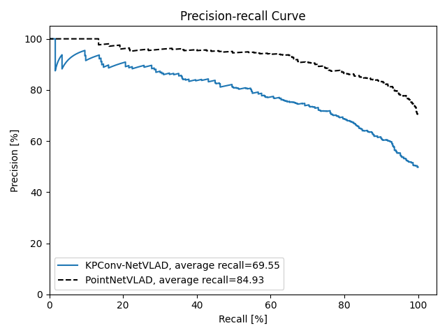
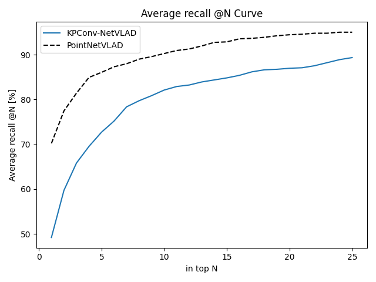

# KPConv-NetVLAD
## Introduction
This is a repository forked from [Hugues THOMAS](https://github.com/HuguesTHOMAS/KPConv-PyTorch). 
In this repository, KPConv is used as an encoder to learn the local features of the point clouds. NetVLAD is intergrated to learn the global descriptor for performing place recognition. 

## Installation
This implementation has been tested on Ubuntu 20.04 with docker evironment. Details are provided in [docker folder](./docker/README.md).

## Experiement
This implementation has been tested on [Oxford Robocar benchmark](https://drive.google.com/drive/folders/1Wn1Lvvk0oAkwOUwR0R6apbrekdXAUg7D) which is created by [mikacuy/pointnetvlad](https://github.com/mikacuy/pointnetvlad).
By training it on 3 sequences, the average recall is 69.55 %.

Training:
```
python train_Oxford.py
```

Evaluation:
```
python evaluation_place_recognition.py
```

Result:

